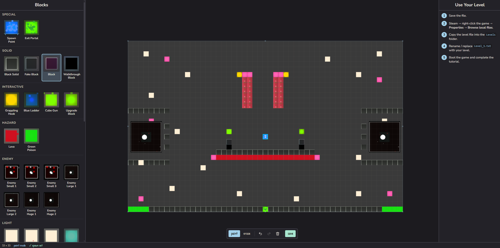
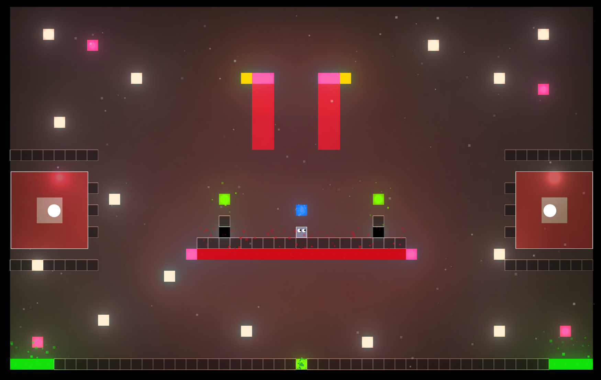

# Escape the Game — Level Editor

Temporarily hosted at: https://escape-the-game.ericbs.dev

A browser-based level editor for the Steam game **Escape the Game** (2016).





## Run

Install [mise](https://mise.jdx.dev/) (Windows):

```powershell
winget install mise
```

Then:

```bash
mise run editor
```

Open **http://localhost:3000**.
